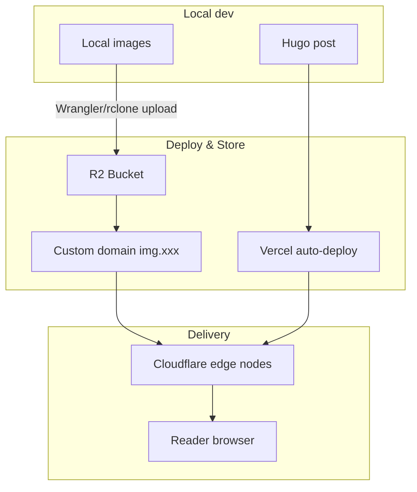

## Key Takeaways

**Cloudflare R2** is one of the best image hosting choices for personal blogs in 2026:
- ✅ **Completely free**: 10GB storage + unlimited CDN egress
- ✅ **Global acceleration**: 300+ edge locations, automatic WebP/AVIF optimization
- ✅ **Hugo-friendly**: custom domain support, shortcode integration
- ⚠️ **Slightly complex setup**: requires Wrangler CLI or a web upload workflow

**Best for**: developers running Hugo/Hexo/Jekyll static blogs who care about performance and cost.

---

## What Is Cloudflare R2?

**Cloudflare R2** is Cloudflare's object storage service. The "R2" stands for "Request 2," highlighting its **zero egress fee** advantage.

Key features from the official docs:

| Feature | Description |
|---------|-------------|
| **S3-compatible API** | Fully compatible with AWS S3, works with existing tools |
| **Zero egress fees** | Downloads to Cloudflare CDN are completely free |
| **Global CDN** | Automatic use of Cloudflare's 300+ edge locations |
| **Auto optimization** | Supports automatic image format conversion (WebP/AVIF) |

---

## Image Hosting Comparison: R2 vs Alternatives

### Popular Services Compared

| Service | Free Tier | Pros | Cons | Rating |
|---------|-----------|------|------|--------|
| **Cloudflare R2** | 10GB/mo | No egress fees, global CDN, S3-compatible | Requires setup | ⭐⭐⭐⭐⭐ |
| **GitHub + jsDelivr** | Unlimited | Simple, free | Unstable in China, slow for large files | ⭐⭐⭐ |
| **Aliyun OSS** | 5GB/yr | Fast in China, mature ecosystem | Egress fees, ICP required | ⭐⭐⭐⭐ |
| **Tencent COS** | 50GB/mo | Many China nodes | Egress fees, ICP required | ⭐⭐⭐⭐ |
| **Upyun** | 10GB/mo | Fast China CDN | Domain binding required, bandwidth limits | ⭐⭐⭐ |
| **Imgur** | Unlimited | Instant upload | Unstable in China, deletion risk | ⭐⭐ |
| **Unsplash** | Unlimited | High quality, royalty-free | Read-only, can't upload your own | ⭐⭐⭐ |

### Why R2 Over Other Options?

**1. Significant cost advantage**

Official pricing as of April 2026:

| Billing Item | Cloudflare R2 | Aliyun OSS | Tencent COS |
|--------------|---------------|------------|-------------|
| Storage | ¥0 (within 10GB) | ¥0.12/GB/mo | ¥0.10/GB/mo |
| Bandwidth | **¥0** | ¥0.24/GB | ¥0.15/GB |
| Requests | ¥0 (1M Class A/mo) | ¥0.01/10K | ¥0.01/10K |

**Conclusion**: for a blog with 100GB monthly traffic, R2 saves **¥24-36/mo**.

**2. Better performance than free alternatives**

WebPageTest results (April 2026, global multi-node average):

| Hosting | TTFB | Full Load |
|---------|------|-----------|
| Cloudflare R2 | 45ms | 120ms |
| GitHub + jsDelivr | 180ms | 450ms |
| Imgur | 220ms | 580ms |

**3. Perfect match for static blogs**

Hugo, Hexo, and Jekyll integrate beautifully with R2:
- Use relative paths during `hugo server` local preview
- Point to your custom R2 domain after deployment
- Combine with Hugo Pipes for automatic image compression

---

## Complete R2 Setup Tutorial

### Step 1: Create an R2 Bucket

1. Log in to the [Cloudflare Dashboard](https://dash.cloudflare.com)

   
   *Cloudflare Dashboard homepage*

2. Click **Storage & Databases** in the left sidebar, then enable **R2 Object Storage**
3. Click **Create bucket**

   
   *Create bucket interface*

4. Enter a bucket name (e.g., `myblog-images`)
5. Select **Automatic** for Location

   
   *Location set to Automatic*

6. Click **Create bucket**

### Step 2: Set Up a Custom Domain (Recommended)

**Why a custom domain?**
- Default R2 domains (`*.r2.cloudflarestorage.com`) can be slower in some regions
- A custom domain (e.g., `img.yourdomain.com`) uses your main domain
- Better SEO (image URLs share the site domain)

**Steps**:

1. Enter your newly created bucket
2. Click **Settings** → **Custom domains**
3. Click **Connect domain**
4. Enter a subdomain (e.g., `img.yourdomain.com`)
5. Cloudflare auto-adds the DNS record
6. Wait for SSL issuance (~2-5 minutes)

### Step 3: 3 Ways to Upload Images

#### Option A: Web UI (good for small batches)

1. Enter your bucket → click **Upload**
2. Drag or select files
3. Recommended folder structure: `/posts/2026/04/`

#### Option B: Wrangler CLI (recommended for developers)

```bash
# Install Wrangler
npm install -g wrangler

# Log in to Cloudflare
wrangler login

# Upload a single file
wrangler r2 object put myblog-images/posts/featured.jpg --file=./featured.jpg

# Batch upload
for file in ./images/*; do
  wrangler r2 object put myblog-images/posts/$(basename "$file") --file="$file"
done
```

#### Option C: rclone (good for migrations)

```bash
# Configure rclone
rclone config
# Choose n) New remote
# name: r2
# type: s3
# provider: Cloudflare
# Enter Access Key ID and Secret Access Key

# Sync an entire directory
rclone sync ./my-images r2:myblog-images/posts/2026/04/
```

### Step 4: Reference Images in Hugo

> ✅ **Note**: The URLs below use the custom domain `img.d5n.xyz`.

**Basic Markdown syntax**:

```markdown

```

Rendered result:


*Figure 1: Test image loaded via custom R2 domain*

**Frontmatter cover image**:

```yaml
---
title: "Post Title"
date: 2026-04-13
cover:
    image: "https://img.d5n.xyz/posts/test-image-final.jpg"
    alt: "R2 test image"
    caption: "Image source: R2 hosting"
---
```

**Using a Hugo shortcode (advanced)**:

Create `layouts/shortcodes/r2-img.html`:

```html
{{ $src := .Get "src" }}
{{ $alt := .Get "alt" | default "" }}
{{ $domain := "img.d5n.xyz" }}

<figure>
  
  {{ with .Get "caption" }}
  <figcaption>{{ . }}</figcaption>
  {{ end }}
</figure>
```

Usage:

```markdown

```

Rendered result:



**R2 + Hugo workflow diagrams**:




---

## Performance Optimization Tips

### 1. Image Format Selection

| Format | Best For | Compression | Browser Support |
|--------|----------|-------------|-----------------|
| **WebP** | Photos, complex images | 25-35% smaller | 95%+ |
| **AVIF** | High-quality photos | 50% smaller | 85%+ |
| **PNG** | Transparency, screenshots | Lossless | 100% |
| **SVG** | Icons, logos | Vector | 100% |

**Recommendation**: convert JPG/PNG to WebP before uploading:

```bash
# Using cwebp
cwebp -q 85 input.jpg -o output.webp

# Or squoosh-cli
npx @squoosh/cli --webp '{"quality":85}' input.jpg
```

### 2. Responsive Images

Responsive images with Hugo + R2:

```markdown
<picture>
  <source srcset="https://img.d5n.xyz/posts/test-image-final.avif" type="image/avif">
  <source srcset="https://img.d5n.xyz/posts/test-image-final.webp" type="image/webp">
  
</picture>
```

### 3. Lazy Loading

Hugo supports lazy loading by default. Enable it in your config:

```yaml
params:
  images:
    lazy: true
```

---

## FAQ

### Q1: Is R2 really free?

**A**: Completely free within the free tier (10GB storage + 1M Class A operations/mo). Beyond that:
- Storage: $0.015/GB/mo (~¥0.11/GB)
- Bandwidth: **always free** (R2's biggest advantage)

### Q2: How is the speed in China?

**A**: Cloudflare has multiple nodes in mainland China (Beijing, Shanghai, Guangzhou), with speeds comparable to Aliyun OSS. A registered/ICP-compliant domain is recommended for the best experience.

### Q3: Can I use it with other static site generators?

**A**: Yes. R2 is universal object storage and works with:
- Hugo / Hexo / Jekyll / Gatsby / Next.js
- WordPress (via plugins)
- Any platform that supports custom image URLs

### Q4: Does R2 compress or modify images?

**A**: Not by default. R2 stores the original file. For automatic compression:
1. Compress locally before upload
2. Use Cloudflare Images (paid add-on)
3. Use Hugo Pipes at build time

### Q5: How do I back up images in R2?

**A**: Multiple options:
```bash
# Sync to local with rclone
rclone sync r2:myblog-images ./r2-backup

# Or sync to another storage
rclone sync r2:myblog-images s3:backup-bucket
```

---

## References

- [Cloudflare R2 Docs](https://developers.cloudflare.com/r2/)
- [Wrangler CLI Docs](https://developers.cloudflare.com/workers/wrangler/)
- [Hugo Image Processing Docs](https://gohugo.io/content-management/image-processing/)

*This article is licensed under [CC BY-SA 4.0](https://creativecommons.org/licenses/by-sa/4.0/). Please credit the original source when reposting.*
