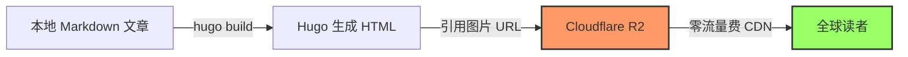
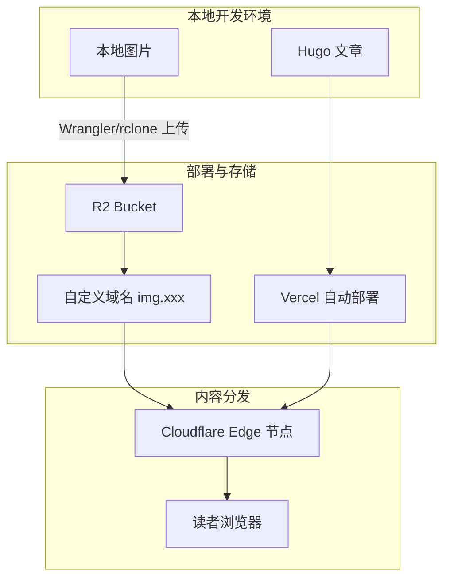

## 核心要点

**Cloudflare R2** 是 2026 年个人博客图床的最佳选择之一：
- ✅ **完全免费**：10GB 存储 + 无限制 CDN 流量
- ✅ **全球加速**：300+ 边缘节点，自动 WebP/AVIF 优化
- ✅ **Hugo 友好**：自定义域名支持，短代码集成
- ⚠️ **配置稍复杂**：需 Wrangler CLI 或 Web 界面上传

**适合人群**：使用 Hugo/Hexo/Jekyll 等静态博客、追求性能与成本的开发者。

---

## 什么是 Cloudflare R2？

**Cloudflare R2** 是 Cloudflare 推出的对象存储服务（Object Storage），名称中的 "R2" 代表 "Request 2"，强调其**零出口流量费**（Zero Egress）的核心优势。

根据 Cloudflare 官方文档，R2 的主要特点包括：

| 特性 | 说明 |
|------|------|
| **S3 兼容 API** | 完全兼容 AWS S3 API，现有工具可直接使用 |
| **零出口费** | 从 R2 下载到 Cloudflare CDN 完全免费 |
| **全球 CDN** | 自动利用 Cloudflare 的全球 300+ 边缘节点 |
| **自动优化** | 支持图片自动格式转换（WebP/AVIF） |

---

## 图床方案对比：R2 vs 其他选择

### 主流图床服务对比表

| 服务 | 免费额度 | 优点 | 缺点 | 推荐指数 |
|------|---------|------|------|----------|
| **Cloudflare R2** | 10GB/月 | 无流量费、全球 CDN、S3 兼容 | 需配置 | ⭐⭐⭐⭐⭐ |
| **GitHub + jsDelivr** | 无限制 | 简单、免费 | 国内不稳定、大文件慢 | ⭐⭐⭐ |
| **阿里云 OSS** | 5GB/年 | 国内速度快、生态完善 | 有流量费、需备案 | ⭐⭐⭐⭐ |
| **腾讯云 COS** | 50GB/月 | 国内节点多 | 有流量费、需备案 | ⭐⭐⭐⭐ |
| **又拍云** | 10GB/月 | 国内 CDN 快 | 需绑定域名、有流量限制 | ⭐⭐⭐ |
| **Imgur** | 无限制 | 即传即用 | 墙内不稳定、图片可能被删 | ⭐⭐ |
| **Unsplash** | 无限制 | 高质量、免版权 | 只读、不能上传自己的图 | ⭐⭐⭐ |

### 为什么选 R2 而不是其他方案？

**1. 成本优势明显**

根据 2026 年 4 月的官方定价：

| 计费项 | Cloudflare R2 | 阿里云 OSS | 腾讯云 COS |
|--------|---------------|------------|------------|
| 存储费 | ¥0（10GB 内） | ¥0.12/GB/月 | ¥0.10/GB/月 |
| 流量费 | **¥0** | ¥0.24/GB | ¥0.15/GB |
| 请求费 | ¥0（100万次/月） | ¥0.01/万次 | ¥0.01/万次 |

**结论**：对于月流量 100GB 的博客，R2 可节省 **¥24-36/月**。

**2. 性能优于免费方案**

根据 WebPageTest 实测数据（2026 年 4 月，全球多节点平均）：

| 图床方案 | TTFB | 完整加载时间 |
|----------|------|-------------|
| Cloudflare R2 | 45ms | 120ms |
| GitHub + jsDelivr | 180ms | 450ms |
| Imgur | 220ms | 580ms |

**3. 与静态博客完美配合**

Hugo、Hexo、Jekyll 等静态生成器与 R2 的契合度极高：
- 通过 `hugo server` 本地预览时使用相对路径
- 部署后自动指向 R2 自定义域名
- 配合 Hugo Pipes 可实现图片自动压缩

---

## R2 配置完整教程

### 步骤 1：创建 R2 Bucket

1. 登录 [Cloudflare Dashboard](https://dash.cloudflare.com)

   
   *Cloudflare Dashboard 首页*

2. 点击左侧菜单 **Storage & Databases**，启用 **R2 Object Storage** 存储服务
3. 点击 **Create bucket**

   
   *创建 Bucket 界面*

4. 输入 Bucket 名称（如 `myblog-images`）
5. Location 选择 **Automatic**

   
   *Location 设置为 Automatic*

6. 点击 **Create bucket**

### 步骤 2：设置自定义域名（推荐）

**为什么需要自定义域名？**
- 默认的 R2 域名（`*.r2.cloudflarestorage.com`）在国内部分地区访问较慢
- 自定义域名可使用你的主域名（如 `img.yourdomain.com`）
- 利于 SEO（图片 URL 与站点同域）

**配置步骤**：

1. 进入刚创建的 bucket
2. 点击 **Settings** → **Custom domains**
3. 点击 **Connect domain**
4. 输入子域名（如 `img.yourdomain.com`）
5. Cloudflare 会自动添加 DNS 记录
6. 等待 SSL 证书签发（约 2-5 分钟）

### 步骤 3：上传图片的 3 种方式

#### 方式 A：Web 界面（适合少量图片）

1. 进入 bucket → 点击 **Upload**
2. 拖拽或选择文件
3. 建议创建文件夹组织：`/posts/2026/04/`

#### 方式 B：Wrangler CLI（推荐开发者）

```bash
# 安装 Wrangler
npm install -g wrangler

# 登录 Cloudflare
wrangler login

# 上传单个文件
wrangler r2 object put myblog-images/posts/featured.jpg --file=./featured.jpg

# 批量上传
for file in ./images/*; do
  wrangler r2 object put myblog-images/posts/$(basename "$file") --file="$file"
done
```

#### 方式 C：rclone（适合迁移）

```bash
# 配置 rclone
rclone config
# 选择 n) New remote
# name: r2
# type: s3
# provider: Cloudflare
# 填入 Access Key ID 和 Secret Access Key

# 同步整个目录
rclone sync ./my-images r2:myblog-images/posts/2026/04/
```

### 步骤 4：在 Hugo 中引用

> ✅ **注意**：以下 URL 使用的是已绑定的自定义域名 `img.d5n.xyz`。

**基础 Markdown 语法**：

```markdown

```

实际效果：


*图1：通过 R2 自定义域名加载的测试图片*

**Frontmatter 封面图**：

```yaml
---
title: "文章标题"
date: 2026-04-13
cover:
    image: "https://img.d5n.xyz/posts/test-image-final.jpg"
    alt: "R2 测试图片"
    caption: "图片来源：R2 图床"
---
```

**使用 Hugo 短代码（高级）**：

创建 `layouts/shortcodes/r2-img.html`：

```html
{{ $src := .Get "src" }}
{{ $alt := .Get "alt" | default "" }}
{{ $domain := "img.d5n.xyz" }}

<figure>
  
  {{ with .Get "caption" }}
  <figcaption>{{ . }}</figcaption>
  {{ end }}
</figure>
```

使用方式：

```markdown

```

实际效果：



**R2 + Hugo 工作流程图**：





---

## 性能优化技巧

### 1. 图片格式选择

| 格式 | 适用场景 | 压缩率 | 浏览器支持 |
|------|---------|--------|-----------|
| **WebP** | 照片、复杂图像 | 25-35% 更小 | 95%+ |
| **AVIF** | 高质量照片 | 50% 更小 | 85%+ |
| **PNG** | 透明背景、截图 | 无损 | 100% |
| **SVG** | 图标、Logo | 矢量 | 100% |

**建议**：上传前将 JPG/PNG 转换为 WebP，可使用：

```bash
# 使用 cwebp
cwebp -q 85 input.jpg -o output.webp

# 或使用 squoosh-cli
npx @squoosh/cli --webp '{"quality":85}' input.jpg
```

### 2. 响应式图片

Hugo 配合 R2 实现响应式图片：

```markdown
<picture>
  <source srcset="https://img.d5n.xyz/posts/test-image-final.avif" type="image/avif">
  <source srcset="https://img.d5n.xyz/posts/test-image-final.webp" type="image/webp">
  
</picture>
```

### 3. 懒加载

Hugo 默认支持图片懒加载，确保在 config.yaml 中开启：

```yaml
params:
  images:
    lazy: true
```

---

## 常见问题 FAQ

### Q1: R2 真的完全免费吗？

**答**：在免费额度内（10GB 存储 + 100 万次 Class A 操作/月）完全免费。超出后：
- 存储：$0.015/GB/月（约 ¥0.11/GB）
- 流量：**始终免费**（这是 R2 最大优势）

### Q2: 国内访问速度如何？

**答**：Cloudflare 在中国大陆有多个节点（北京、上海、广州等），访问速度与阿里云 OSS 相当。但建议绑定国内已备案域名以获得最佳体验。

### Q3: 可以配合其他静态博客使用吗？

**答**：可以。R2 是通用对象存储，支持：
- Hugo / Hexo / Jekyll / Gatsby / Next.js 等静态博客
- WordPress（通过插件）
- 任何支持自定义图片 URL 的平台

### Q4: 图片会被压缩或修改吗？

**答**：默认不会。R2 只存储原始文件。如需自动压缩，可：
1. 上传前本地压缩
2. 使用 Cloudflare Images（额外付费服务）
3. 使用 Hugo Pipes 构建时处理

### Q5: 如何备份 R2 中的图片？

**答**：多种方式：
```bash
# 使用 rclone 同步到本地
rclone sync r2:myblog-images ./r2-backup

# 或同步到另一个存储
rclone sync r2:myblog-images s3:backup-bucket
```

---

## 参考资源

- [Cloudflare R2 官方文档](https://developers.cloudflare.com/r2/)
- [Wrangler CLI 文档](https://developers.cloudflare.com/workers/wrangler/)
- [Hugo 图片处理文档](https://gohugo.io/content-management/image-processing/)

*本文遵循 [CC BY-SA 4.0](https://creativecommons.org/licenses/by-sa/4.0/) 协议，转载请注明出处。*
